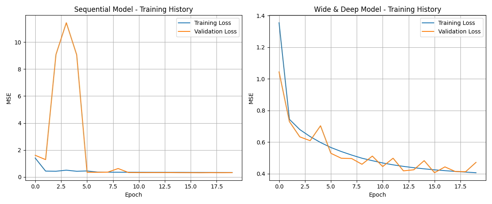

一、資料概況\
集合	筆數	特徵數\
Training	11,610	8\
Validation	3,870	8\
Test	5,160	8
\
數據分割合理，典型 60/20/20 分配。\
這是加州房價資料集常見的配置。

二、模型架構比較\
模型	結構	參數量	特點\
Sequential	Dense(30, ReLU) → Dense(1)	301	單純線性堆疊、訓練穩定\
Wide & Deep	(Input → Dense(30→30)) + Concatenate(Input) → Dense(1)	1,239	同時結合「原始特徵」與「深層特徵」\
三、訓練過程觀察\
(1) Sequential 模型\
Epoch	訓練損失	驗證損失\
1	2.5944	1.6136\
5	0.3870	9.0549\
10	0.3632	0.3350\
20	0.3391	0.3288\

分析：

一開始 loss 很高（正常，剛開始學習）。\
第 3–5 epoch 出現 validation loss 爆掉（例如 9.07、11.43）→ 表示訓練過程有暫時不穩定（可能是學習率太高或資料異常波動）。\
之後模型穩定收斂，val_loss 降至約 0.33，表現不錯。

最終：

Test MSE ≈ 0.35

代表平均平方誤差不大，模型能有效預測。

(2) Wide & Deep 模型\
Epoch	訓練損失	驗證損失\
1	2.02	1.04\
5	0.606	0.703\
10	0.487	0.511\
15	0.443	0.483\
20	0.413	0.471

分析：

學習曲線穩定，沒有明顯發散；

val_loss 明顯下降，但最終停在 0.4–0.47 附近；

沒有像 Sequential 那樣降得那麼低（0.33）。

最終：

Test MSE ≈ 0.4063

表現略差於 Sequential 模型。

四、模型比較\
| 指標       |         Sequential       | Wide & Deep |     哪個比較好   |\
| ------     | ----------------        | ----------- | -------------    |\
| 訓練穩定度  | 較不穩定（中期 loss 爆高) |   穩定      |        平手      |\
| 最終驗證損失| 約 0.33                  | 約 0.41     |  Sequential     |\
| 測試 MSE   | 0.3508                   | 0.4063      |  Sequential     |\
| 模型參數量 | 301                       | 1,239      |  Sequential（更小)|\
| 泛化能力   | 中上                      | 中等        |  Sequential     |

結論：

在這組資料上，「簡單的 Sequential 模型」表現反而比 Wide & Deep 更好。

五、預測結果對照\
Sequential model predictions: [0.763, 1.673, 4.249]\
Actual values:                [0.477, 0.458, 5.000]

分析：

第 1 筆：預測 0.76 vs 實際 0.48 → 還算接近；

第 2 筆：預測 1.67 vs 實際 0.46 → 高估；

第 3 筆：預測 4.25 vs 實際 5.00 → 低估。

模型傾向「平均化」預測，對於極高或極低價格會拉回中間。\
屬於 典型的線性迴歸偏差現象。

六、模型行為解釋

Sequential 模型表現較佳的原因：

資料特徵僅 8 維，結構簡單，深層模型反而容易 overfit；

Wide & Deep 在這樣的小資料集上不一定帶來明顯收益；

加入 Concatenate 的 “wide branch” 提高參數量，但資料不足以支撐。

Wide & Deep 模型略差的原因：

「wide branch」雖保留原始特徵，但若資料關係非線性明顯，會導致訊息干擾；

未加正則化（如 Dropout 或 L2），容易過擬合微小噪音；

學習率可能偏高。

七、整體結論\
模型	MSE	評價\
Sequential	0.3508	 表現最佳、結構簡潔、泛化良好\
Wide & Deep	0.4063	 表現略差、可能過擬合或干擾

在這個任務中，簡單的模型反而更好。\
因為資料維度低、特徵間關係線性為主，過度複雜的結構會降低效能。

我們可以針對結果畫出一張圖\
\
此張圖描述了:\
Sequential 模型雖在早期出現明顯震盪，但隨後迅速收斂，最終達到較低的驗證損失（約 0.33）。\
Wide & Deep 模型的訓練過程穩定，驗證曲線平滑，但最終 MSE 約 0.45，略高於 Sequential 模型。\
整體而言，Sequential 模型在此資料集上能更有效捕捉輸入特徵與房價之間的關係，而 Wide & Deep 結構未能帶來明顯效益，顯示對於特徵維度較低的回歸任務，簡單模型即可達到良好表現。
